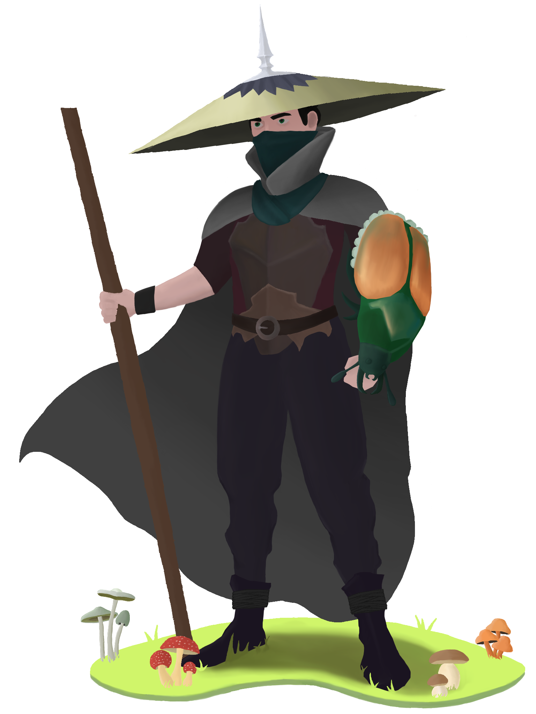

My name is Austin Brown.  I have been coding since I made the game Jeopardy in Microsoft PowerPoint (2000!).

My projects are mainly based on web technologies like Angular or jQuery, ASP.NET or C#, Arduino or Raspberry Pi projects, and a bit of everything mixed in between.

This website exists so I can share some of the fun things I've been working on.

